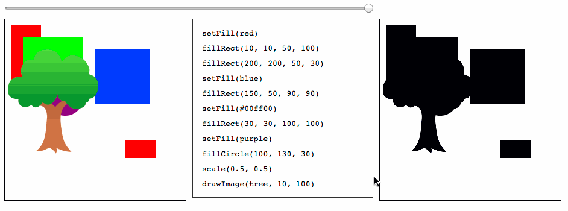

# rewindable-canvas

A canvas that supports rewinding and inspectible causality (e.g. you can click on the canvas to see what code drew the pixel under the cursor).

Not ready for public consumption yet but this is what it looks like:



## Installation

### Browserify

    $ npm install rewindable-canvas

### UMD

```javascript
// some code yadda yadda
```

## API

## License
